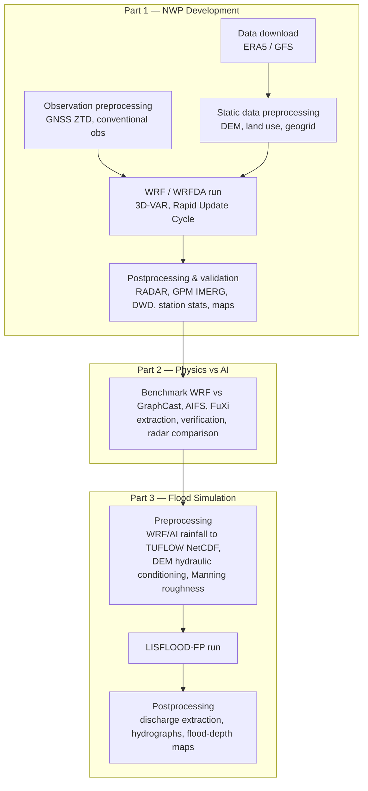

# NWPLux Pipeline

Code supporting the PhD thesis *"A High-Resolution Numerical Weather Prediction Model for Nowcasting Precipitation in the Grand-Duchy of Luxembourg (NWPLux)"* — Haseeb ur Rehman, University of Luxembourg.

This repository contains the scripts used to build, run, and evaluate NWPLux end to end: from downloading raw meteorological data, through the WRF/WRFDA forecast cycle, to benchmarking against AI weather models, to driving the LISFLOOD-FP hydraulic flood model.

## Funding

This work was supported by the **Fonds National de la Recherche Luxembourg (FNR)** under the **Industrial Fellowship (IF)** programme, **Project No. 17130773**, in partnership with RSS-Hydro S.a.r.l.

## Pipeline overview



## Repository structure

```
01_NWP_development/
├── 01_data_download/              ERA5 (CDS API) and GFS (NCAR) retrieval, WPS run scripts
├── 02_static_data_preprocessing/  DEM/land-use conditioning, geogrid binary generation
├── 03_observation_preprocessing/ GNSS ZTD extraction (NGL), conventional obs (NOAA ISD)
├── 04_wrf_wrfda_run/              Rapid Update Cycle automation (see below)
└── 05_postprocessing_and_validation/  RADAR/GPM/DWD comparison, station statistics, all maps

02_physics_vs_ai/                  WRF vs GraphCast/AIFS/FuXi: extraction, verification, radar comparison

03_flood_simulation/
├── 01_preprocessing/              WRF/AI rainfall -> TUFLOW NetCDF; hydraulic_conditioning/ (DEM, bridges, rivers, Manning roughness)
└── 02_postprocessing/             Discharge extraction, hydrographs, flood-depth/domain maps
```

### `01_NWP_development/04_wrf_wrfda_run/`

Four Rapid Update Cycle automation scripts, corresponding to the environments and background-error configurations used in the project:

| Script | Environment | Background error |
|---|---|---|
| `run_ruc_HPC_CV3.sh` | University of Luxembourg HPC cluster (SLURM job array, MPI across nodes) | CV3 (global) |
| `run_ruc_HPC_CV5.sh` | University of Luxembourg HPC cluster (SLURM job array, MPI across nodes) | CV5 (domain-specific) |
| `run_ruc_local_CV3.sh` | Local workstation, no scheduler | CV3 (global) |
| `run_ruc_local_CV5.sh` | Local workstation, no scheduler | CV5 (domain-specific) |

## Related archives (already published, not duplicated here)

The LISFLOOD-FP forcing conversion, CUDA solver patches, and figure-generation code specific to the two flood-simulation manuscripts are archived separately with their own DOIs:

- Rehman et al., *Assessing the Added Value of High-Resolution NWP for Flood Forecasting* — code archive: [10.5281/zenodo.20776731](https://doi.org/10.5281/zenodo.20776731)
- Rehman et al., *From AI Weather Forecasts to Flood Inundation* — code archive: [10.5281/zenodo.20794937](https://doi.org/10.5281/zenodo.20794937)

## Data availability

Scripts only — no raw data is included in this repository.

- **ERA5 / GFS**: publicly available via the Copernicus Climate Data Store and the NCAR Research Data Archive; download scripts in `01_data_download/`.
- **GNSS ZTD**: publicly available from the Nevada Geodetic Laboratory; processing scripts in `03_observation_preprocessing/`.
- **AgriMeteo / NOAA ISD conventional observations**: publicly downloadable from the respective public portals; download/processing scripts included.
- **River discharge and water-level records (AGE — Administration de la gestion de l'eau, Luxembourg)** are **not included** in this repository, as their redistribution requires AGE's consent. Contact AGE directly, or contact the author, to request access.

## License

Code is released under the MIT License (see `LICENSE`). This does not extend to any third-party model source code (WRF, WRFDA, LISFLOOD-FP), which retains its own upstream license.

## Citation

If you use this code, please cite the associated thesis and/or the relevant manuscript(s) listed in the thesis bibliography (manuscripts submitted to NHESS, GMD, and the Journal of Hydrology, 2026).
